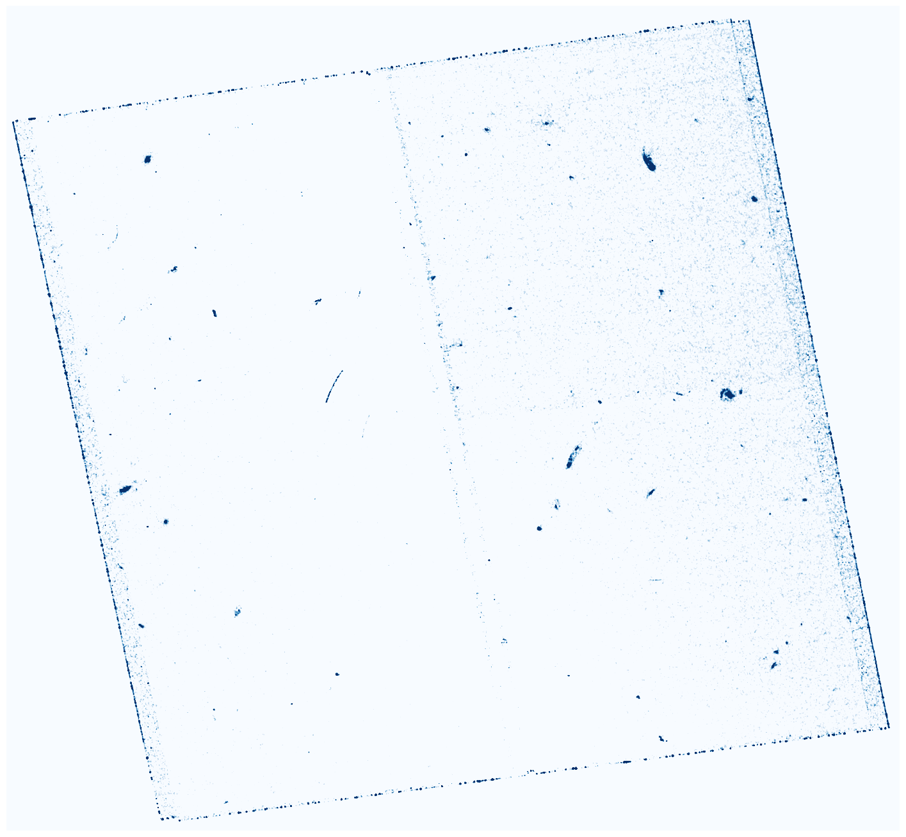

# Deep Frontier Fields Near Ultra-Violet survey

## Data Products

The scientific products of this project will be made available here once they are ready for wide use by the scientific community.

### Target Images (F225W)

- **Abell S1063** - completed observations. image reduction on-going.

Preview image of the FoV.

- **Abell 2744** - scheduled
- **Abell 370** - scheduled
- **MACS 0416** - scheduled
- **MACS 0717** - scheduled
- **MACS 1149** - scheduled

### Parallel Images (F475W)

- **Abell S1063** - completed observations.
Preview image of the FoV.

- **Abell 2744** - scheduled
- **Abell 370** - scheduled
- **MACS 0416** - scheduled
- **MACS 0717** - scheduled
- **MACS 1149** - scheduled
