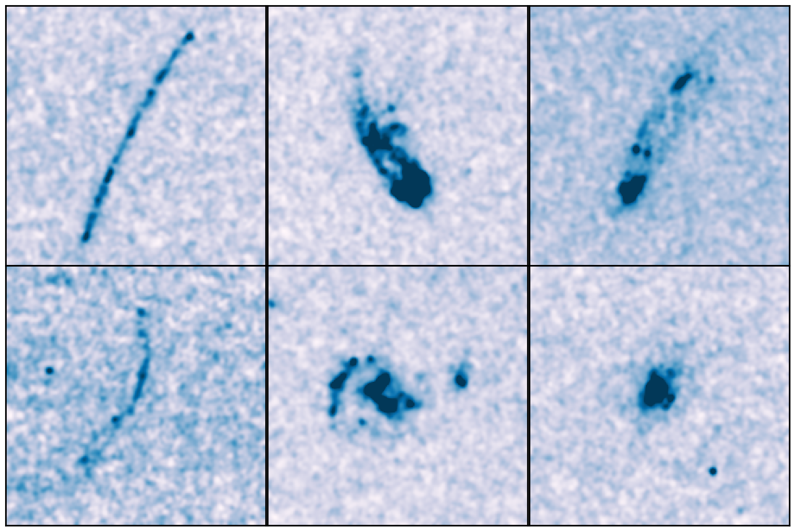

# Deep Frontier Fields Near Ultra-Violet survey

This is a survey based on the cycle 27 [HST 15940](http://archive.stsci.edu/proposal_search.php?mission=hst&id=15940) proposal that observes the six clusters of the  [Hubble Frontier Fields](https://archive.stsci.edu/prepds/frontier/) (HFF) using the F225W filter on HST WFC3/UVIS. We also took advantage of the parallel observation mode of Hubble to acquire ACS F475W images over the HFF parallel fields.

Example of six bright galaxies observed with our HST program.

## Project Summary

The Hubble Frontier Fields (HFF) campaign has been a great success in combining the power of lensing magnification with deep space-based imaging to provide us with our most sensitive views of the universe. To facilitate further z<2 studies, we add deep 0.2 micron imaging observations with the WFC3/UVIS F225W channel to all six HFF clusters, extending the wavelength coverage available with HST from 1.7 microns down to 0.2 microns and enabling tight constraints on the redshifts of star-forming galaxies down to z~1. This opens up an immense range of science on lower-luminosity galaxies at z<2, making it possible to probe the faint-end and possible turn-over of the UV luminosity function to z~1, probing escaping ionizing radiation from galaxies at z~2, expanding the search of tiny star-forming sources down to z~1, and studying star formation and dust properties of galaxies belonging to the targeted clusters (0.3<z<0.6). Our WFC3/UVIS F225W observations fill out the multi-wavelength observations we have of the HFF clusters with Hubble, providing us with an important legacy into the JWST era.

## Survey Progress

As of May 8, we have one complete set of observations for one of the six clusters (see [Data page](data)). We expect the next targets to be observed in the summer of 2020.
