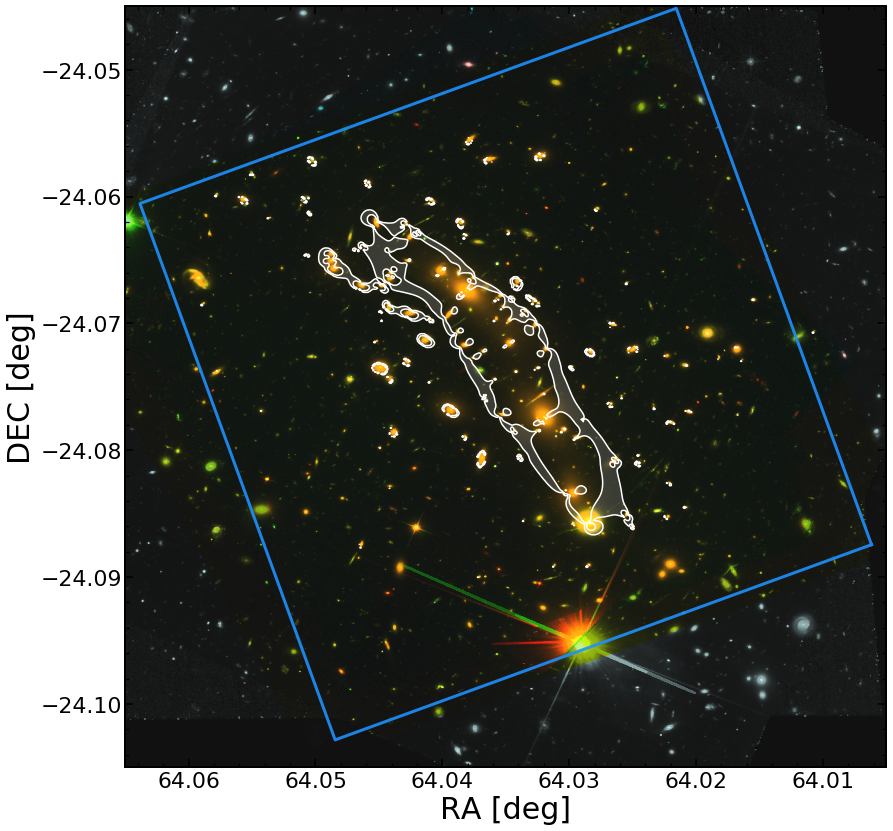

# Deep Frontier Fields Near Ultra-Violet survey

## Targets

We list below the six HFF cluster targets along with the proposed WFC3/UVIS F225W pointing (blue square) for each cluster. We use existing HFF data from the background RGB image and overlay the contours of the magnification map (regions with &mu; > 20) in white contours.

### Images

**Abell S1063**

**Abell 2744**

**Abell 370**

**MACS 0416**

**MACS 0717**

**MACS 1149**

